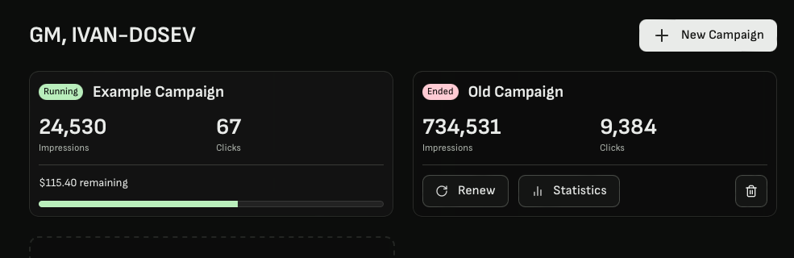

# Dashboard

Welcome to your dashboard.

Here should ideally come the dashboard page 👇

On the left side of the screen, you will be able to see information about the active campaigns:

## Active Campaign: 
1. Campaign Name
2. Campaign status
3. Current number of impressions 
4. Current number of clicks
5. The remaining budget left for this campaign (including the visual bar)

On the right side of the screen, you will be able to see information about the ended campaigns:

## Past Campaign: 
1. Campaign Name
2. Campaign status
3. Total numbers of impressions 
4. Total number of clicks
5. Option to renew the campaign
6. Take a look at the detailed campaign performance
7. Permanently delete past campaign

## Create a new campaign: 
When you hover below the active campaign, you will be able to create a new campaign

Here should ideally come the new page 👇

Instructions for this are [in Studio](./studio.md)
