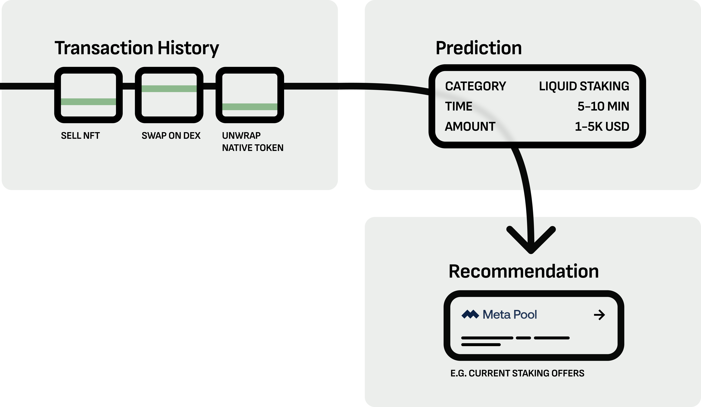

<!-- 

# Overview

Welcome to our GrowthMate docs!

## What is GrowthMate?

GrowthMate is a recommendation platform ...
We run a general purpose [Ranking API](../services/ranking/index.md) that powers our [Advertisements](../services/ads/index.md), and personalized [Discovery Feeds](../services/discovery-feed/).

## How does it work?

When a user logs into a webpage that integrates one of our services, an API request with the users wallet address goes out to our server. We fetch the public users transaction history from the chain and enrich it with additional data. Our propriatary AI model predicts certain aspects of the users next action with 80% accuracy. These include

- Project name
- Time until execution
- Amount of USD involved

Based on this prediction we serve our recommendations. ...

## What data do we use?

We exclusively rely on data that is publicly accessible (transaction history, ip address, ...) and do not employ any client side tracking. -->

# GrowthMate

GrowthMate is a recommendation platform that utilizes AI to transform web3 transaction history into predictive insights, enhancing user engagement through tailored advertisements and personalized content feeds.

## What is GrowthMate?

At its core, GrowthMate is a ranking engine that assesses content relevance based on user interests. Our API processes various items, similar to hashtags, and returns interest-aligned rankings.

## How It Works

When a user engages with a GrowthMate-integrated application:

1. An API request with the user's wallet address is sent to our server.
2. We retrieve the user's public transaction history from the blockchain and enrich it with additional data.
3. Our AI model predicts user actions with 80% accuracy, including:
   - Project name
   - Time until execution
   - Amount of USD involved
4. Tailored recommendations are served based on these predictions.

## Key Features

- **Flexible Sorting**: Ranks any list of items based on user interest.
- **Privacy-Focused**: Uses only publicly accessible data without client-side tracking.
- **High Accuracy**: Predicts behavior with 80% accuracy.

## Use Cases

GrowthMate’s ranking capabilities can be applied to:

- Targeted ad campaigns
- Personalized discovery feeds
- Suggested dApps, quests, and relevant news

By offering this robust ranking system through an accessible API, GrowthMate enables seamless integration of personalized content sorting in web3 applications.