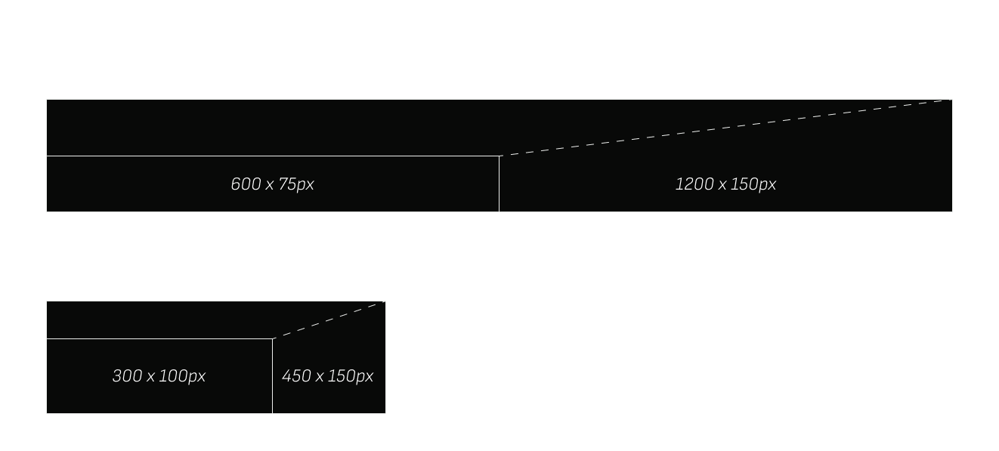

# GrowthMate for Ads

GrowthMates Ad-Network is a layer built on top of our core recommendation engine. By leveraging AI-driven insights, the ad-network delivers more relevant ads to users, resulting in increased engagement and higher click-through rates (CTR). This approach not only improves efficiency for advertisers but also leads to better returns for publishers through more effective ad placements.

## Ad Sizes

We currently support two dynamic ad sizes that automatically scale for different screen resolutions:

## Ad Review Process

All ads undergo a manual review before being approved. GrowthMate reserves the right to pause or stop campaigns that do not meet our standards, with a particular focus on avoiding scams or misleading projects.