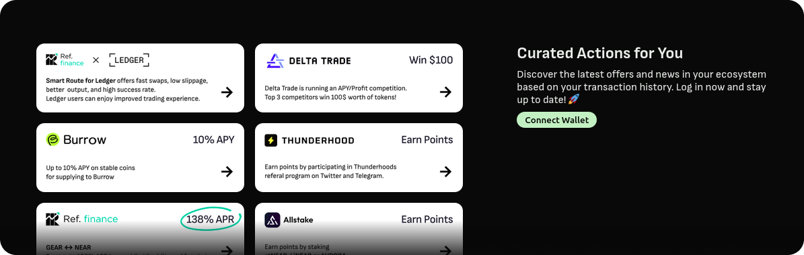

# Discovery Feed

Our personalized Discovery Feed is a layer built on our recommendation engine, designed to boost user retention, minimize churn, and drive transactions. It can be easily integrated into platforms like block explorers, portfolio pages, or wallets.

For an example of the feed in action, please check out our [feed demo](https://demo.growthmate.xyz/#/feeds?unblur).

## Key Features

- **Actionable Posts**: The feed features news and offers that promote specific actions, providing clear benefits to users.

- **Free Posting for Projects**: Projects can share posts at no cost, subject to a rate limit that encourages focus on essential user actions.

- **Manual Approval**: All posts are manually approved to prevent spam and scams.

- **Customizable Visibility**: Hosts can implement white or blacklists to control which posts are displayed, such as showing news only from partners.